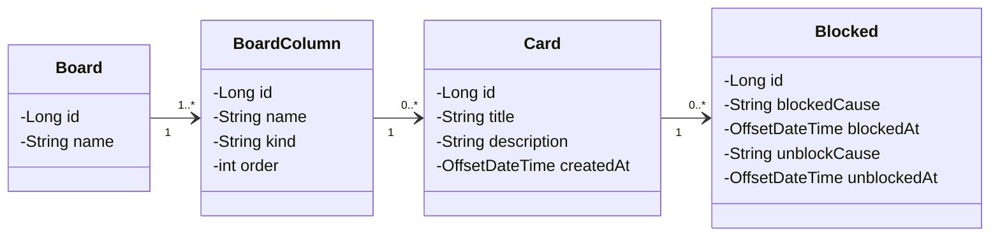

# Desafio Dio Board de tarefas
Desafio da DIO para construir um board de tarefas usando persistência no banco de dados.

## Diagrama UML
Diagrama UML simplificado das entidades utilizadas

```mermaid
classDiagram
direction LR
    class Board {
	    -Long id
	    -String name
    }
    class BoardColumn {
	    -Long id
	    -String name
	    -String kind
	    -int order
    }
    class Card {
	    -Long id
	    -String title
	    -String description
	    -OffsetDateTime createdAt
    }
    class Blocked {
	    -Long id
	    -String blockedCause
	    -OffsetDateTime blockedAt
	    -String unblockCause
	    -OffsetDateTime unblockedAt
    }
    Board "1" --> "1..*" BoardColumn
    BoardColumn "1" --> "0..*" Card
    Card "1" --> "0..*" Blocked

```
